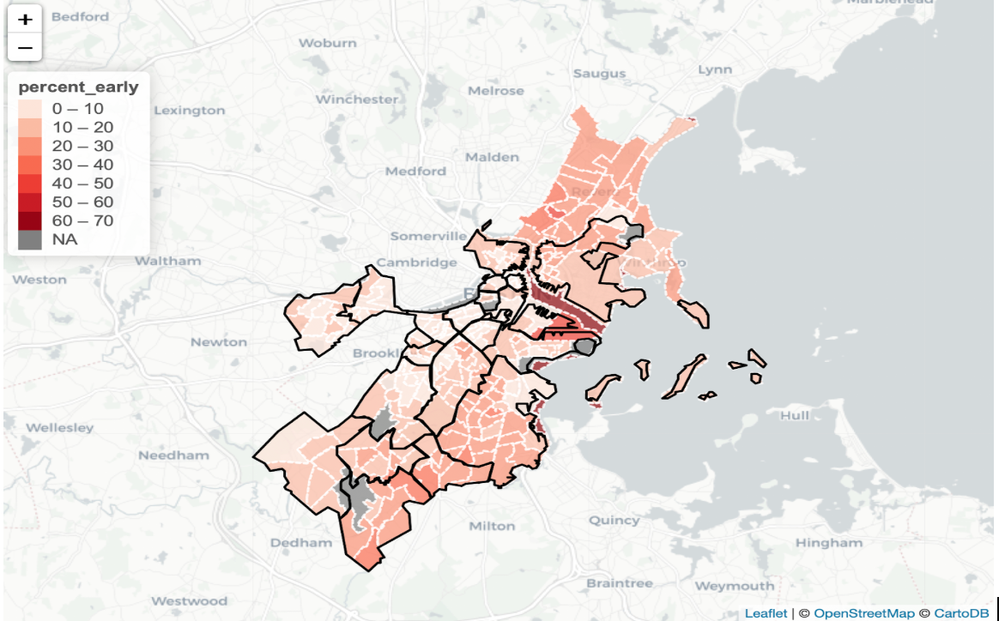

#Introduction
##Community Labor United
Community Labor United (CLU) is a non-profit organization, operating in the Greater Boston Area, that works with other community-based establishments and labor unions across Massachusetts to cultivate strategic campaigns that protect and promote the interests of low and middle-income working class families [@CLU]. Their overall goal is to promote policies that advocate for accessible jobs, healthcare, childcare, housing and environmental justice for working class households [@CLU]. Through their Our Care That Works coalition that launched publicly this year, Community Labor United aims to bring together various local cooperative groups to confront the child care crisis in Massachusetts. More specific to this research, CLU was interested in examining the inconsistencies in childcare within the Greater Boston Area, caused by the negligence of the Department of Early Education and Care (EEC). This investigative exploration into childcare provision gaps within the Greater Boston Area will allow Community Labor United to communicate to the EEC the demand for the standardization of childcare within Massachusetts.

##EEC Literature Review
The Department of Early Education and Care’s mission is to maintain the growth and development of all children, by providing quality childcare programs and resources for families within their communities [@EEC]. However, the research lead by Community Labor United and their affiliated organizations shows that the EEC has been unable to effectively execute their commitment for low and middle-income working class families.  
We will be adding more limitations after we receive some literature from Sarah about the EEC and childcare! (Sorry, friend)

##Research Question
As stated before, the general goal for this research was to examine the inconsistencies in the EEC by highlighting childcare provision gaps in the Greater Boston Area. More specifically, this project focused on illustrating a disparity in operating hours and capacity for childcare providers on the neighborhood level and census tract level. Because Community Labor United is concentrated on understanding how the low and middle-income households are impacted by the current childcare system, our project focused on emphasizing the childcare demands needed for working class families. Additionally, CLU was interested in concentrating on early education provision care, which encompasses childcare for children ages five and under. For hours, we looked at how the non-typical work week is affected by the early education provision that is currently supplied, since people with low and middle-incomes work at times that operate outside the typical 9:00am - 5:00pm job. We wanted to understand if there were a sufficient number of childcare facilities that could offer early education provision outside Monday - Friday, 7:30am - 6:00pm, for people in the Greater Boston Area. Similarly for capacity, we wanted to highlight the lack of available slots for early education provision for working households with children age five and under. This is because working-class families typically have all parents in the household in the workforce, so it is crucial that the childcare capacity supply matches the demand.  
Individually, the child provision gaps in hours and capacity shows how the Department of Early Education and Care has neglected low and middle-income families in specific ways. However, we also think it’s important to understand how the interaction between lack of available childcare hours and lack of early education provision spots impact these households overall. To best convey that interaction, we compiled our visualizations and supporting information on an easily accessible platform. This allows for the user to quickly navigate the various maps for hours and capacity, and also share these findings with all appropriate parties. It is our hope that Community Labor United will be able to use the visualizations we’ve created to motivate the Department of Early Education to make reforms to the current childcare system to be more accommodating for all families in Massachusetts, regardless of occupation or availability.  

#Method
In order to quantify the gap in supply and demand for childcare in Boston, we decided to focus on the capacity of the existing childcare providers in comparison to the number of children who need childcare, as well as the hours that providers are able to provide childcare in comparison to the hours when childcare is most needed by those who work outside standard hours. These areas were chosen because both for their urgency in affecting access to and need for childcare, as well as for the lack of existing research that exists on the gaps between the childcare that exists and the childcare that is needed.

##Data

The data from our main analyses consisted of two data sources, one addressing the supply side of the gaps in childcare, and the other addressing the demand. The supply data source we used was given to us by *Community Labor United*, and it was a collection of providers from the Department of Early Education and Care (EEC) in Massachusetts. The initial dataset consisted of 8,318 observations, with each row representing a childcare provider in Massachusetts. Since our project focused specifically on the Boston area, we filtered the dataset to contain only cities in Boston, which left us with 764 remaining childcare providers. The cities included were Allston, Boston, South Boston, Brighton, Charlestown, Dorchester, East Boston, Hyde Park, Jamaica Plain, Mattapan, Roslindale, Roxbury, and West Roxbury. Cities with the highest concentration of providers included central Boston (100), Dorchester (203) and Roxbury (70). 

There is no existing dataset that tells us about childcare demand specifically, so to answer this question we used census data, specifically the *American Community Survey* (ACS), and filtered for certain variables of interest. The following methodology will discuss specific variables in detail, but data was derived from the 2016 American Community Survey and was filtered for Suffolk County, Massachusetts. 

We wanted to convey the gap in childcare by a geography that would be big enough to generalize findings, but small enough that we could be specific and not overlook any areas that might have findings of interest. Through consultation with CLU, we decided on convey our results by the neighborhood level. To do this, we accessed Boston neighborhood shapefile data [@bostonshapefile] and assigned each EEC childcare provider to a certain neighborhood. Since the census data of interest was only accessible by tract, we developed a file that matched each census tract to a neighborhood, and included both tract geometry and neighborhood geometry to allow for easy mapping. More about this process is discussed in the challenges section.

#Capacity

##Supply

To get a sense of the slots available for early education provision, we took the EEC dataset and filtered only for providers that provide early education childcare. We first used R and Python to clean the variables. We then used the tidyverse package to group the providers by census tract, and calculated the total number of slots for early education childcare in each tract. Since we were interested in looking at differences on both the tract level and the neighborhood level, we repeated this process for neighborhood so that we also had the total number of slots for early education childcare in each neighborhood. We merged these datasets with the respective geometry for each geography, to allow us to map the results.

##Demand

Demand for capacity of childcare was assessed through the use of the 2016 ACS. The tigris and tidycensus packages were used in congruence with an API key to access census data in R. We chose the ACS as opposed to other forms of census data because it was the only survey that was easily compatible with R that also had all data available for all variables of interest on the tract level for Suffolk County. 

To quantify the number of children that need childcare, we used the ACS variable “B23008”, which gives estimates per tract of the total number of children under 6 years old, as well as the number of children under 6 in two-parent households with both parents in the labor force, as well as single parent households (either mother or a father) with the parent in the labor force. We then added up these three variables, with the assumption that anybody with all parents in the labor force would need childcare. To get a percentage of children under 6 with all parents in the labor force, we divided this number by the total number of children under 6. All calculations were per tract. 

##Maps

Three maps were made as a final product for visualizing the gap in capacity. Two of these maps (Figure 1 and Figure 2) looked at supply and demand at the tract level, mapping the raw number of children under 6 with all parents in the workforce as well as the raw number of slots available for early ed care per tract, to be compared. The third map (Figure 3) quantified the difference in supply and demand by neighborhood, as a ratio of children under 6 with parents in the workforce to available childcare slots. Since it is unrealistic that one would restrict their childcare search to within their census tract, a rather small boundary, we wanted to give a more realistic range of how far a childcare search might go, hence the rationale for grouping by neighborhood.

###Hours

##Supply

Our main focus with the question of hours was to get a sense of the providers who provided childcare outside of the typical standard workday, which we defined as anytime outside of 7:30am-6pm on weekdays. We did not include weekday care since there were only a few providers that provided any weekend care at all. Therefore to get our dataset for supply, we created a variable based on the information about hours in the EEC dataset to flag any provider that provided care during nonstandard hours, and summarized the number of slots they had for those hours.

##Demand

One large problem with census data is that in any workday related variables, it assumes workers work 5 days a week, with the same number of hours every day. This definition contradicts the purpose of our study, which is to investigate those who work nonstandard hours. Therefore, the only census variable that made sense to use when investigating hours was the time leaving work. Using previous ACS methodology given to us by CLU, we split the nonstandard times leaving for work into three categories: early mornings if they leave for work anytime between 12am-6:29am, evenings if they leave for work anytime between 11am-3:59pm, late evening/overnight if they leave for work anytime between 4pm-11:59pm. We took the ACS variables corresponding to these responses in variable B08302, and divided the number of people in each category by the total number of people in the workforce to get a percentage of people in each category. We also summarized the number of people in the three nonstandard time chunks to get a total percentage of people leaving during any nonstandard hour.

##Maps

Five maps were made to visualize the gap in supply and demand for hours. Three of the maps were choropleth maps by tract visualizing the percentage of people who left at each of the nonstandard times: early, evening, and late evening/overnight (See Figure 1 for an example of this map). Another similar map was made by tract using the aggregate percentage of all people leaving during any of these nonstandard hours. Finally, to visualize supply, a map was made of the number of slots available for nonstandard hours of childcare by provider by tract.

#Results and Dsicussion

This section summarizes the data utilized and how the maps we create illustrate  the gap between demand and supply of childcare services for children under 6 in the Boston area. We start by presenting the summary statistics of the data sets, analyzing each individual map, and then proceed to analyze the relationship among them.

##Summary Statistics

Table 1 in the appendix presents the summary statistics on the distribution of the capacities of all providers and capacities available in neighborhoods and tracts. The mean capacity of providers is 24.7, of all neighborhoods in Boston is 1469, and of tracts in Boston is 169.2.

Table 2 in the appendix presents the summary statistics on the distribution of the capacities of all providers that operate outside 7:30am-6:00pm during weekdays and the capacities of them in neighborhoods and tracts.

##Graphs for Capacity

In this section we conduct graphical analysis on the two variables we are interested in: capacity and hours.

Figure 1 shows the number of children under 6 whose parents are in the labor force (i.e., actively looking for jobs) on the level of neighborhoods. We are especially in them since they are target consumers of childcare services for early ed. Being in the labor force means that the parents might to too busy to pay enough attention and provide enough cares to their children, thus requiring the aids from childcare providers. According to the map, tracts that have the largest number of children under 6 who would need childcare services are mainly located in the east and west parts of Boston (i.e., upper and lower regions on the map), including East Boston, West Roxbury, Hyde Park, and Dorchester.
  
Figures 2 shows the number of childcare slots available for children under 6 on the level of tracts. The two tracts that contain more slots than others are located in Dorchester and Downtown, but compared to Figure 2, the slots are apparently more evenly distributed across tracts. It is worth paying attention to that providers in the regions where there is a large number of children under 6, including the east and west parts of Boston, do not provide enough number of slots to feed the need of families in these areas. The difference between supply and demand explains the high desert ratio in these regions as shown in Figure 3.

We first visualize the gap between supply and demand for childcare services for early education through the capacity variables. Figure 1 shows the ratio of children under age 5 to the cumulative child care capacity in the neighborhoods of Boston. The darker the red color, the more children are competing to obtain a licensed child care slot, and therefore the harder it is for a child to obtain the childcare service he/she needs. According to the graph, East Boston, Charlestown, South Boston, Dorchester, Mattapan, Roslindale, Hyde Park, and West Roxbury could be classified as child care deserts. To solve this issue, more childcare providers should be established in those neighborhoods and current providers should expand their capacities.
To get a closer look at the capacity, the two figures below show the demand and supply of capacities by tracts.
 
##Graphs for Hours

In this section, we look into the working hours of families and the operating hours of providers to examine whether there is a mismatch.
 
Figure 4 shows the percentage of parents in tracts who depart for jobs early in the morning. On average, people who live in the East Boston and West Boston areas (north and south areas on the map) leave earlier for works than people who live in other regions. These are also the regions where there are relatively larger number of children under 6 in need of childcare services. The tracts where the largest percentages of people leave for jobs early are located at are waterfront areas of South Boston and Dorchester.
 
Figure 5 shows the percentage of parents in tracts who leave for home in the late evening. On average, people who live in the East Boston, West Boston areas (north and south areas on the map), and waterfront tracts Brighton and Allston leave from workplaces for home later than people who live in other regions. The tracts where the largest percentages of people leave for home later than usual are located at Roxbury and the waterfront areas of Jamaica Plain.

Figure 6 shows the percentage of parents in tracts who depart for home from the workplace overnight. On average, people who live in South Boston and West Boston areas (north and south areas on the map) leave later for home than people who live in other regions. These are also the regions where larger percentage of people leave early and where there are relatively larger number of children under 6 in need of childcare services. The tracts where the largest percentages of people leave for jobs early are located at are waterfront areas of South Boston and Dorchester.

Figure 7 shows the number of slots available for early by providers that open before 7:30am and close after 6pm during weekdays. It indicates that there is a significant lack of capacities in regions where families have a difficult commute time. In general, people from working families living in East Boston, West Boston, South Boston, and the waterfront areas of Allston, Brighton, and Jamaica Plain are most in need of off hour childcare services. However, we could see that there are only a few slots offered by childcare providers that operate off hour available for children in West Boston and South Boston, and none for children in South Boston and the waterfront areas of Allston, Brighton, and Jamaica Plain. Accordingly, more off hour slots should be provided in these regions.
 

#Challenges and Limitations

##Challenges
There are two main challenges that we deal with for this project. First is data cleaning for the EEC dataset. The EEC dataset has a messy data format and a lot of columns that contain information on several different variables. To extract information that we need to create the capacity and hours variables, we utilize various functions and packages from R and Python to clean, merge, and spread variables from the original dataset, such as minimum age, rates, open and close time of providers. 

Second is the geographical classification. One of the narratives of this project is to look at the supply and demand by the tract and neighborhood levels, the information of which are not provided in the original datasets we are given. We deal with this issue by geocoding the providers’ locations, deciding which polygon each provider falls within using the over function from the rgeos package.
 
##Limitations
First some of the variables from census datasets are based on assumptions different from real life situations. Specifically, people’s departure time for work is created based on the assumption that people work for the same amount of hours everyday while the parents we are most interested in are those that have irregular working hours.

Second, our general lack of ability to match census data variables with variables EEC provide to compare different variables for the same construct. Although we successfully create the desert ratio by using the capacity and children population from the EEC and census datasets, there are many other variables the project could look into, such as income level of citizens vs. subsidy of providers.   

Third, there is a lack of data in the EEC dataset about important variables, such as the capacity of each providers by age groups and subsidy amount in dollars. The absence of these variables prevents us from looking more deeply into the supply for childcare services. 
There are many variables that we clean but do not look into due to the limited amount of time we have, such as subsidy, availability of drop-in and emergency services. 

#Discussion and Conclusion

To examine the inconsistencies in the EEC by highlighting childcare provision gaps in the Greater Boston Area, we utilize EEC datasets and census datasets to create maps that illustrate a disparity in operating hours and capacity for childcare providers on the neighborhood level and census tract level. In a word, East Boston and West Boston neighborhoods, including Allston, Boston, South Boston, Brighton, Charlestown, Dorchester, East Boston, Hyde Park, Jamaica Plain, Mattapan, Roslindale, Roxbury, and West Roxbury, are the regions where the gaps apparently exist. 
According to the visualizations of the “capacity” variable, providers in East Boston and West Boston, where there is a large number of children under 6, do not offer enough number of slots to feed the need of families in these areas. Similarly, the maps on the “hours” variable indicate that there is a lack of childcare off hour services for working families living in East Boston, West Boston, South Boston, and the waterfront areas of Allston, Brighton, and Jamaica Plain are most in need of off hour childcare services. According to the median income level map of Boston, most of these neighborhoods are also regions where income levels are lower than the average income level of the Boston area [@bostonmap]. The limited financial capability of citizens of these areas might force them to work during irregular hours and to send their children to the childcare providers. On the other hand, the providers in these regions could not provide enough slots for children under 6 as they could not earn as much money from these low-income families as they could from families in the central areas. To resolve the gap, the policy intervention and support from EEC could be urgent.  
In a word, our graphical analysis successfully illustrates the existence of the gap between supply and demand for early ed childcare services in the Boston area. For researchers who are interested in digging more deeply into this topic in the future, we suggest several directions they could explore into. First, people could match more variables on the demand for childcare services with variables on the supply for childcare services to illustrate the existence of gaps. Second, people could try to obtain a more comprehensive dataset from EEC to have a closer look at the supply of childcare services for different age groups. Third, people could conduct a childcare survey by themselves to have first-hand information directly from the providers and families in need of childcare services in Boston. Fourth, people could encharge the studied area to the whole mass 

#Appendix

{width=300}

{width=300}

{width=300}

{width=300}

{width=300}

{width=300}

{width=300}

{width=300}

{width=300}

# References {#references.unumbered}

